# ECommerce Simulation API (FastAPI · PostgreSQL · Redis · Docker)

## Overview
This repository contains a fully containerized backend system that simulates a production-style e-commerce flow with detailed API design, validation, authentication, persistence, caching, logging, CI/CD, and documentation.

The goal is to showcase clarity, correctness, reliability, and real-world engineering practices.

---

## API Flow Demonstration (Video)
**End‑to‑end workflow:** User Registration → Login → Adding Items to Cart → Checkout → Logout

<video src="https://github.com/angeu4/ecommerce_simulation/blob/6f2ca72a6de05f7382bdb5cf071547d6162f7a7b/assets/api_flow_recording.mov"
       width="800"
       controls
       loop>
</video>

## Table of Contents
1. [Architecture](#architecture)
2. [API Endpoints](#api-endpoints)
3. [API Interaction Model](#api-interaction-model)
4. [Running the Application](#running-the-application)
5. [Codebase Structure & Quality](#codebase-structure--quality)
6. [Persistence Model](#persistence-model-postgresql--redis)
7. [Containerization](#containerization)
8. [Logging](#logging)
9. [Testing](#testing)
10. [Automated API Documentation](#automated-api-documentation)
11. [CI/CD](#cicd)
12. [Improvements & Future Work](#improvements--future-work)
13. [Appendix](#appendix)

---

## Architecture

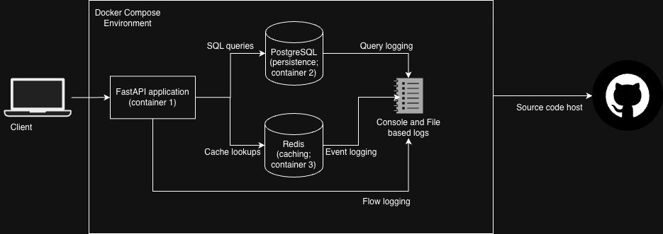

This system is composed of:
- **FastAPI server** (core application + routing + validation + dependency injection)
- **PostgreSQL** (persistent data storage)
- **Redis** (caching + ephemeral data)
- **Rotating file & console loggers**
- **Docker Compose** for orchestration

The APIs interact with:
- Users → cart + authentication flows  
- Admins → discount rules, report generation  
- Redis → caching & temp state  
- PostgreSQL → durable storage  

---

## API Endpoints

### **User APIs**
| Method | Endpoint | Description | Permissible HTTP status codes |
|--------|----------|-------------|-------------|
| POST | `/users` | Create user | 201, 409, 500 |
| POST | `/auth/user/login` | User login & token issuance | 200, 401, 500 |
| POST | `/auth/user/logout` | Logout & token revocation | 200, 401, 500 |
| POST | `/cart/items` | Add item to user cart | 201, 401, 500 |
| POST | `/checkout` | Creating an Order and checking out | 201, 401, 400, 500 |

### **Admin APIs**
| Method | Endpoint | Description | Permissible HTTP status codes |
|--------|----------|-------------|-------------|
| POST | `/admins` | Create admin | 201, 409, 500 |
| POST | `/auth/admin/login` | Admin login | 200, 401, 500 |
| POST | `/auth/admin/logout` | Logout | 200, 401, 500 |
| PUT | `/admin/config/discount-n` | Configure Nth order discount and discount percentage | 200, 500 |
| POST | `/admin/discount-codes` | Issue discount codes | 201, 500 |
| GET | `/admin/reports/summary` | Reporting endpoint | 200, 500 |

### **System**
| Method | Endpoint | Description | Permissible HTTP status codes |
|--------|----------|-------------|-------------|
| GET | `/health` | Readiness & liveness check | 200 |

---

## API Interaction Model

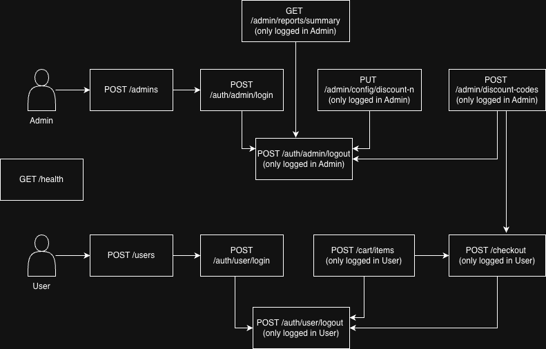

### Highlights:
- **JWT tokens** stored in PostgreSQL with server-side revocation  
- Strict Pydantic models for all request & response validation  
- Separation between **user** vs **admin** authorization  
- Discount logic:  
  - *Nth order discount rule*  
  - *Discount codes issued by admins*  
- Checkout uses both Redis (discount details) and PostgreSQL (order persistence)  

---

## Running the Application

### **Start via Docker Compose**
```sh
docker compose up --build
```

### Services:
- API → `http://localhost:8000`  
- FastAPI OpenAPI docs → `http://localhost:8000/docs`  
- PostgreSQL → `localhost:5432`  
- Redis → `localhost:6379`  
- **Data completely destoyed on app bootup to closely simulate an in-memory store, not persisted across bootups**

### **Postman Collection Included**
```
postman/
  ECommerceSimulation.postman_collection.json
  ECommerceSimulation.postman_environment.json
```

---

## Codebase Structure & Quality

```
app/
 ├── core/             # settings, constants, exceptions
 ├── middleware/       # logging, request_id tagging
 ├── routers/          # admin and user API logic
 ├── utils/            # utilities
 ├── auth              # auth related services 
 ├── db                # db connection setup
 ├── main              # starting point
 ├── models            # db model definition
 └── schemas           # api request and response payload schema definitions
```

### Principles Followed
- Full **type hints** for all functions
- Clean separation of concerns  
- **Pydantic** used for both request + response validation  
- SQLModel for ORM with enumerations  
- Comments throughout for clarity: functional as well as statement level
- Logging across the codebase for better debuggability

---

## Persistence Model (PostgreSQL & Redis)

### **ER Diagram**
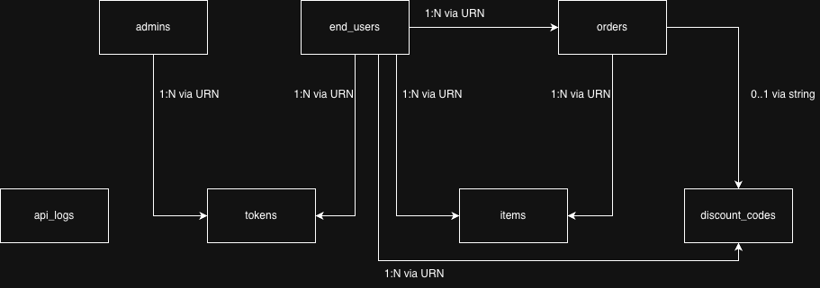

**Data completely destoyed on app bootup to closely simulate an in-memory store, not persisted across bootups**

### **PostgreSQL Overview**

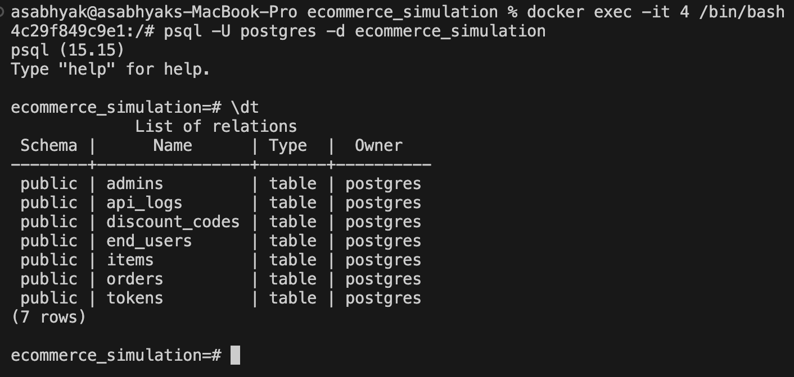
Tables:
- `end_users`
- `admins`  
- `items`  
- `orders`  
- `discount_codes`  
- `tokens`  
- `api_logs`  

### **Redis Key Structure**
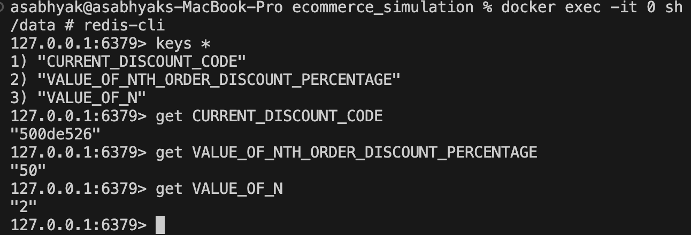

Keys include:
- `VALUE_OF_N`  
- `VALUE_OF_NTH_ORDER_DISCOUNT_PERCENTAGE`  
- `CURRENT_DISCOUNT_CODE`

---

## Containerization

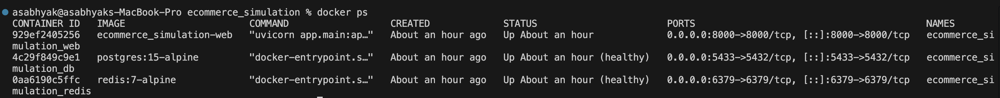

Features:
- API waits for PostgreSQL & Redis readiness  
- Controlled retries  
- Clean separation of service concerns  
- Logs stored & rotated inside container volume  

---

## Logging

### **Console Logging**
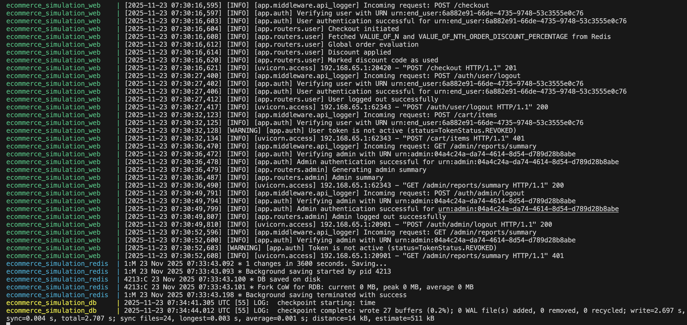

### **File Logging**
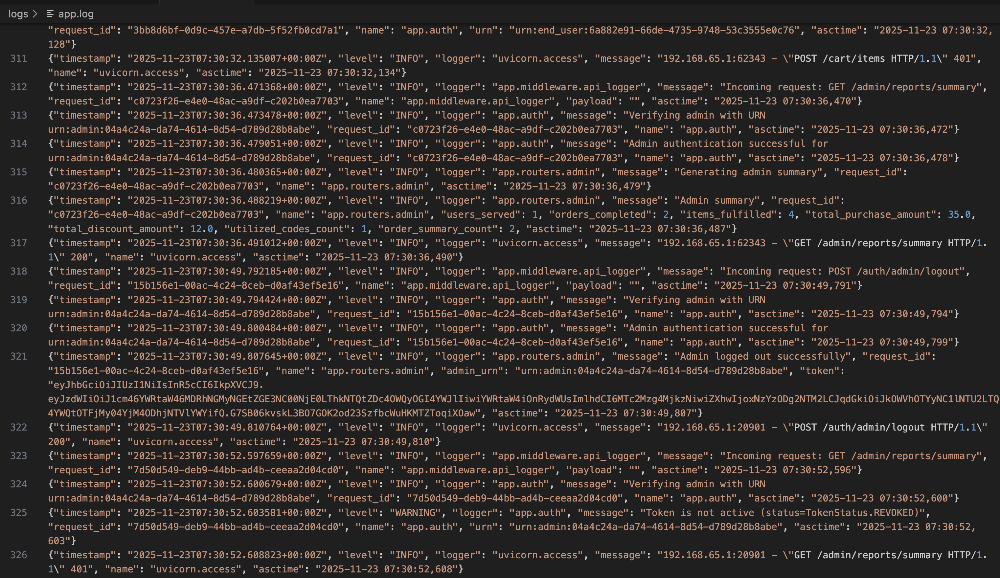

Components logged:
- API requests and responses with Request IDs  
- Auth events  
- Cart operations  
- Database queries  
- Cache access  
- Errors with traceback  

---

## Testing

Includes:
- **Unit tests** for functions & services  
- **Integration tests** using FastAPI TestClient  
- Dependency overrides for isolated DB/Redis
- Authentication tests  

---

## Automated API Documentation

FastAPI auto-generates OpenAPI documentation.

### General Docs
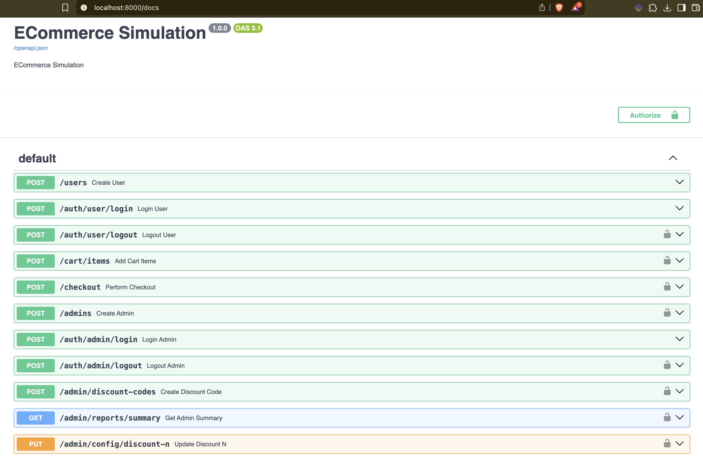

### Users Module
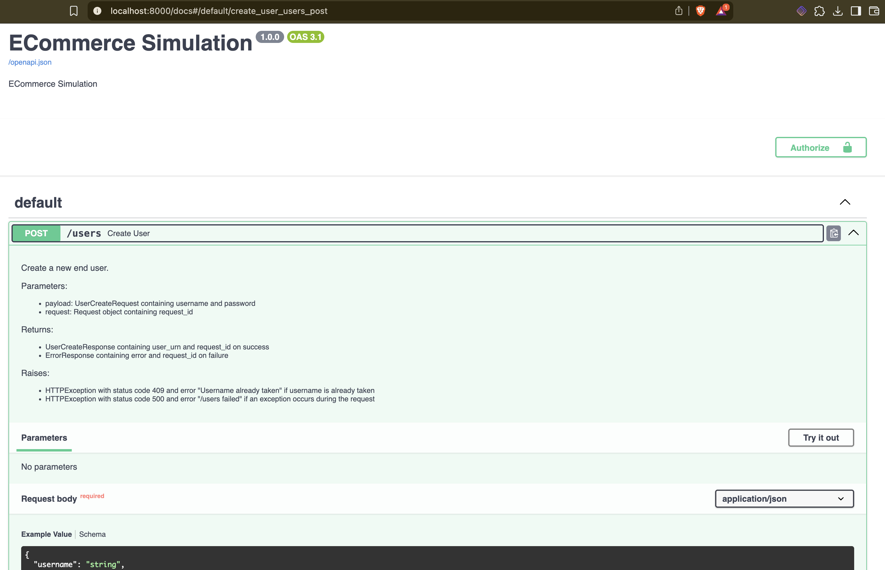

---

## CI/CD

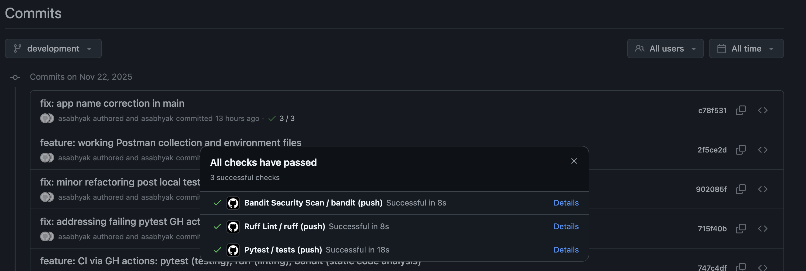

CI pipeline includes:
- Installing dependencies  
- Running Pytest tests  
- Linting using Ruff
- Static source code analysis using Bandit 

---

## Improvements & Future Work

### **Domain-Driven Design (DDD)**
A deeper domain separation could:
- Improve testing structure  
- Limit cross-module coupling  
- Enable domain events  

### **Frontend UI**
Could demonstrate:
- Admin panel  
- User checkout experience  
- Order history  

### **Advanced Features**
- Async worker queues

---

## Appendix

### **Request Lifecycle Diagram**
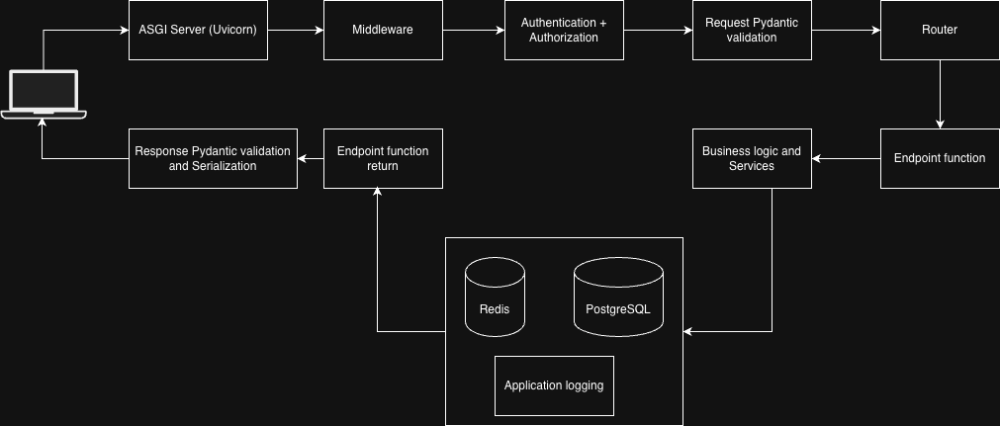

---